# Library HashTable

## What is it good for?

For some special use cases, where something comparable to an "array with strings as index" is needed.
  
In IEC languages we don't have such constructs, but sometimes it could be helpful.  
Of course it would be possible to work with a "array (structure) of / with strings", but if the amount of data is high, the "normal search" for a string inside such a array (loop trough the array until comparing the strings match) would last very long, depending on the position of the string inside the array.

One solution then could be a sorted array and optimized searching strategy, or for example using a hash table (if sorted data is not necessary or not wanted).

### Example use cases

Identify data / information indexed by strings with a high number of "index strings", e.g.

- Text linked to alarm numbers (coded as strings), where the numbers are not used in a steady way / order
- Additional information linked to (error) names
- Anything else, where a "string-based primary key" could be helpful

### Indented use
* The implemented functionality just addresses the topic "find a string out of a higher number of strings in a appropriate time"
  * everything else has to be implemented by your own, based on your concrete use case!
  * if, for example, using file based data to hash it, the file has to be loaded & parsed at every startup of the PLC
* Please mention, that all informations are stored just in DRAM
  * the complete hash table plus all administrative informations resides in allocated memory
  * the "data set" linked to a hash entry is just a pointer

## Runtime comparison measurement  
Test case: "find string in hash table" versus "find string by looping trough data array".

- The measure was executed on a X20CP1585, with 67600 unique strings used as "index".  
   Looping straight through all the string, the runtime until "string found" of course depends on the strings position inside the array, and it differs 1 us < search time < 12874 us.
- Searching inside the hash table with same number of strings hashed, the runtime until "string found" depends on the number of strings that have the same hash value (and therefore of course on the hash function itself), and here it differs 5us < search time < 62 us.

As expected, the search time is much more constant and less then straight looping.

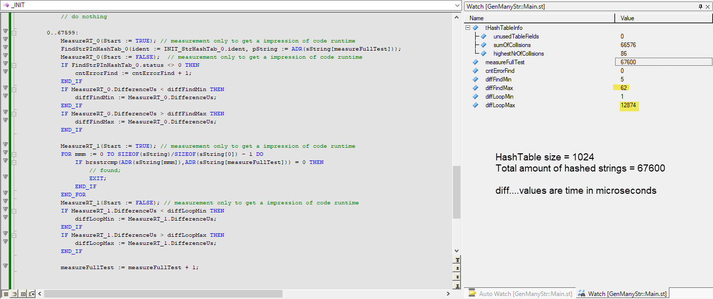

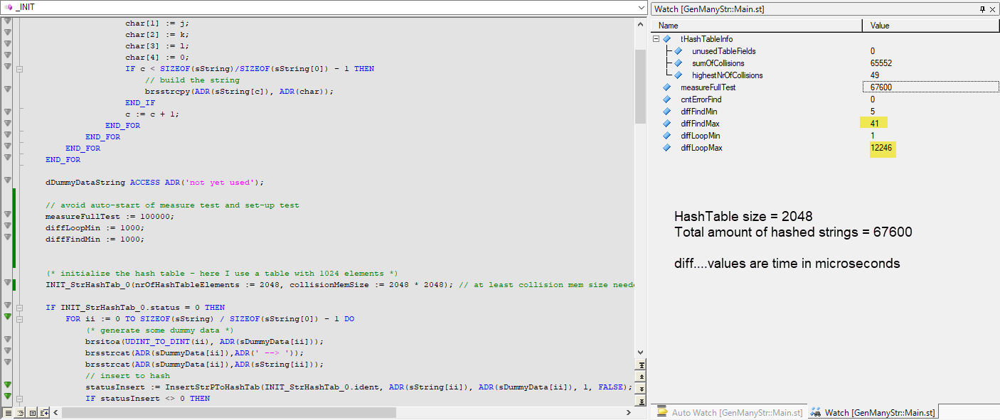

## Basic scheme of the data model and the FB / FC implementation
This basic scheme describes the data model and how the functions / function blocks are working.

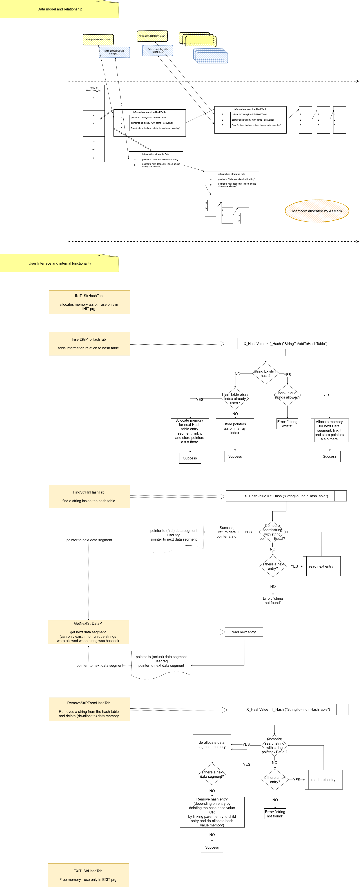

## Function Blocks / Functions - User Interface

### FB's / FB's of the library "HashTable"  
Please be aware, that some functions have restricted use (highlighted in the screenshot below).

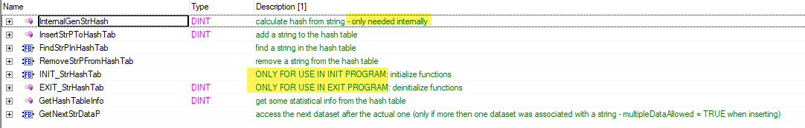

For FB's / FC's interface variables, please check the description for some information about the inputs / outputs.

### INIT_StrHashTab & EXIT_StrHashTab  
(De-)allocate memory for hash table, key elements, data elements, and so on. Be aware that the "collisionMemSize" maybe even needs a size of "some megabytes", depending on "how many strings should be hashed".  

How much collision mem size is needed?

This is not easy to answer, it depends on the size of the hash table and the number of strings to hash. For example: hash array size is 256, number of strings is 8000 -> so we'll have at least around 7744 collisions multiplied with sizeof(HashTableFieldEntry_typ) which is 24 byte.... that means, for this example we have to allocate at least around 8000 \* 24 byte -> 192k … but to have the possibility to add some more strings later on and also to use more than one dataset per entry, you should even allocate "much more" then the minimum calculated collision memory (how "much more" depends on your use case)

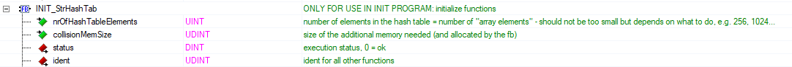

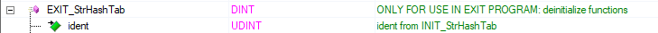

### InsertStrPToHashTab
Add a string into the hash table

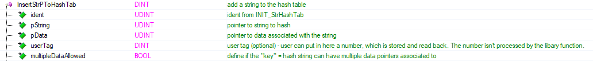

### FindStrPInHashTab  
Find a string in the hash table

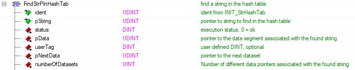

### GetNextStrDataP
Get next "data set", if a found string is associated with more then one data segment.
The user can setup the behavior "more then one dataset per unique hash string is allowed" by setting ".multipleDataAllowed = TRUE" when calling "InsertStrPToHashTab".

Check ".numberOfDatasets" returned by "FindStrPInHashTab" to figure out, if more then one data segment is linked.

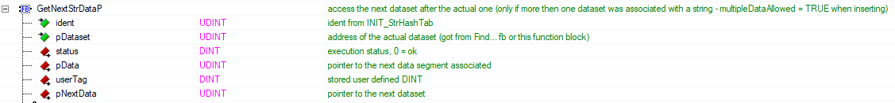

### RemoveStrPFromHashTab  
delete a string (and of course all of it's data segments) from hash table

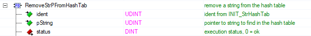

### GetHashTableInfo  
Read out some statistics about memory usage a.s.o.  
Please see description of datatype "HashTableInfo_typ" below.

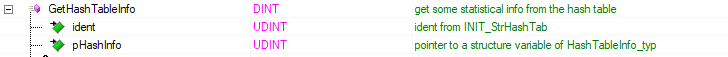

### Error messages of the library  
Return values from FCs, or .status element from FBs = Constants of the library

Error messages not listed in the libraries constants are status codes returned from used standard libraries (AsBrStr, AsMem) 🡪 see Automation Studio help

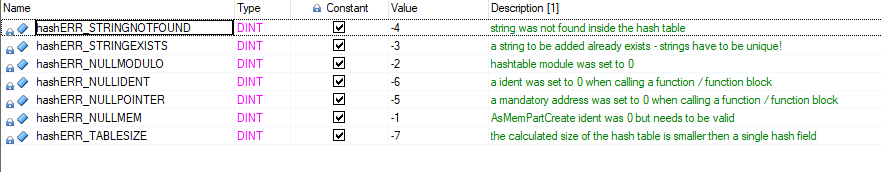

### Structures of the library

Please be aware that the user only needs one structure (highlighted in the screenshot below), all other structures are only needed internally!

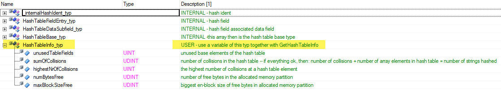

## License

Copyright (c) 2025 Alexander Hefner

All code and content of this package is licensed under the MIT License, see "LICENCE.txt" for details.

