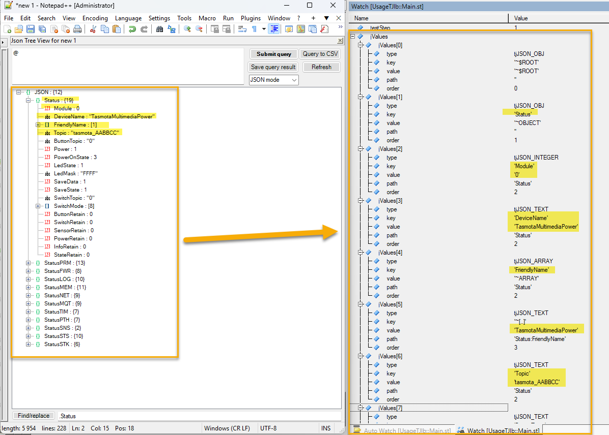
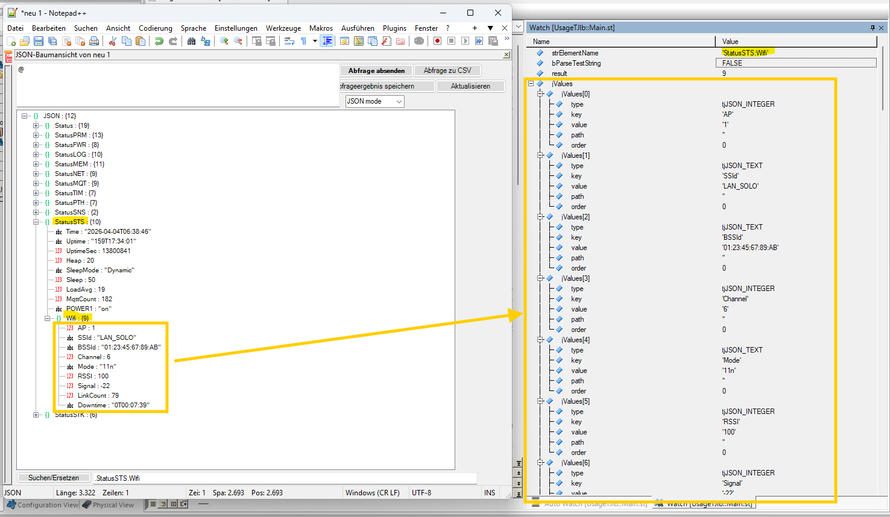

# Intention
Some already existing, great solutions out there are build to deserialize (and serialize) JSON strings directly to PLC variable structures.
But in my usescase, I just needed to deserialize and to inspect and work with many different JSON responses that additionally frequently change their structure.

So I decided to write my own function to deserialize the JSON responses (based on [tiny-json](https://github.com/rafagafe/tiny-json)) into a flat array of a structure, where each element contains some basic information like...
* name of an element
* value of an element
* type of an element
* order and path information inside the JSON structure
  
... so that I can react to the informations in the JSON object without changing PLC variable declarations.

# Content of the AS package "JsonReader"
* the AS library "TinyJsonLb" exporting the function "TinyJsonDump()", which deserializes a JSON string
* the AS task "UsageTJlb", which just contains some basic test calls

# How to use
* import the library "TinyJsonLn"
* declare an array of structure of type "TinyJsonLibValues_typ" (which is defined by "TinyJsonLb") as result memory
* call the function
> TinyJsonDump( < address of string containing the JSON data > , < address of result array > , < sizeof result array > , < optional: path of JSON sub-element > );

## Example 1 - read complete JSON object
```
VAR
	jValues : {REDUND_UNREPLICABLE} ARRAY[0..255] OF TinyJsonLibValues_typ;
	result : DINT;
END_VAR
```

```
// deserialize the JSON content in "sTestString" into array "jValues" of TinyJsonLibValues_typ[0..255]
// result > 0 --> number of array elements containing data
// result < 0 --> error, please see description in TinyJsonLb->Constants.var

result := TinyJsonDump(ADR(sTestString), ADR(jValues), SIZEOF(jValues), 0);
```



## Example 2: read sub-element from JSON object
```
VAR
	jValues : {REDUND_UNREPLICABLE} ARRAY[0..255] OF TinyJsonLibValues_typ;
	result : DINT;
END_VAR
```

```
// deserialize JSON sub-element 'StatusSTS:Wifi' content into array "jValues" of TinyJsonLibValues_typ[0..255]
// result > 0 --> number of array elements containing data
// result < 0 --> error, please see description in TinyJsonLb->Constants.var

result := TinyJsonDump(ADR(sTestString), ADR(jValues), SIZEOF(jValues), ADR('StatusSTS:Wifi'));
```


# Known limitations
* path and order information invalid, if JSON input string root is array of objects (... work in progress to solve that ...)
* direct reading of sub-elements of type "array element" using "< optional: path of JSON sub-element >" parameter is not possible
* maximum size of JSON input string is 8192 byte (to adapt, change "tinyjson_DATA_BUFFER_SIZE" value and recompile)
* maximum number of tokens in JSON is 256 (to adapt, change "tinyjson_T_MEM_SIZE" value and recompile)

