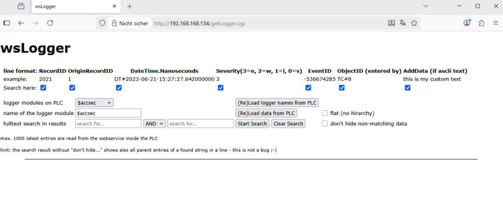
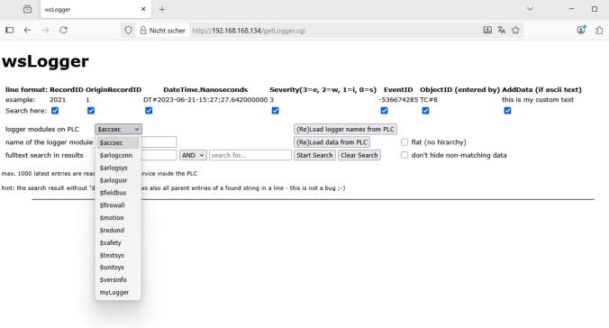
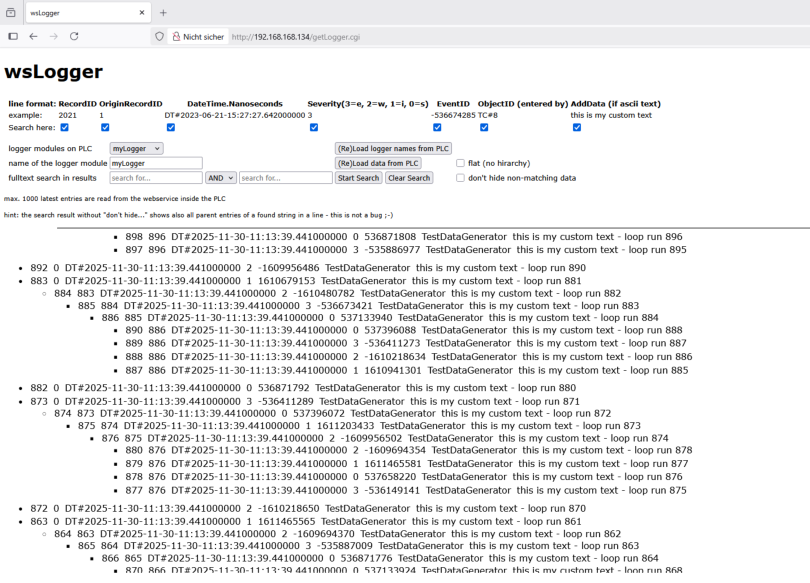
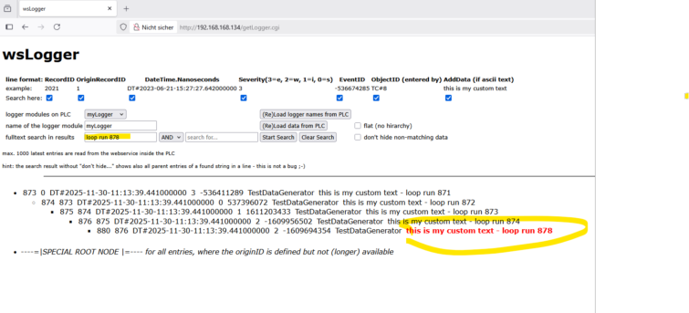
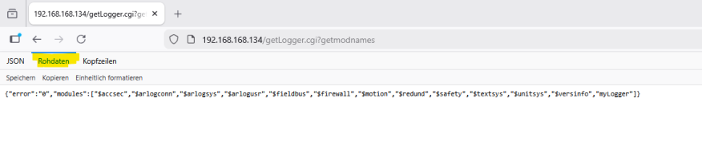
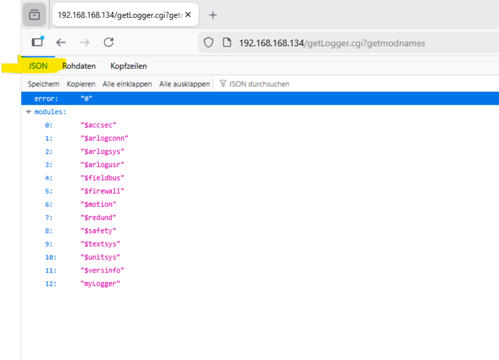
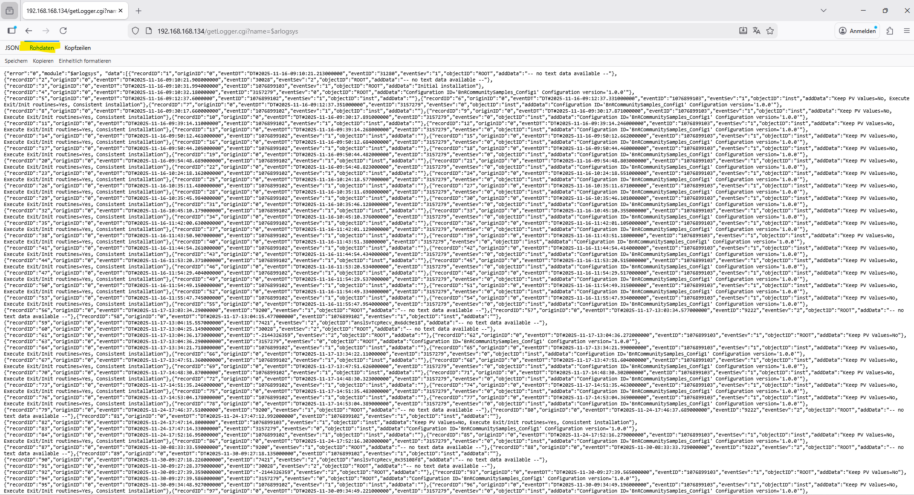
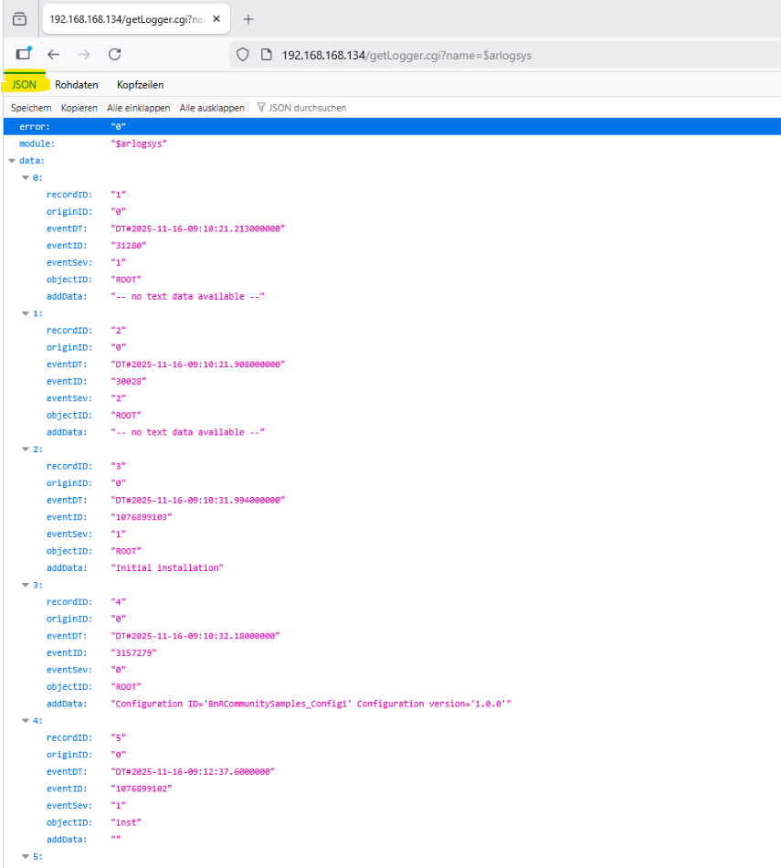

# wsLogger implementation infos 

The task „wsLogger“ provides entries of a logger module as JSON structure, internally using the „ReadEvLog“ library plus some BR libraries like AsHttp. 

The maximum of the last 1000 entries of a logger module can be provided. 

The datamodule „wsLData“ additionally contains a simple frontend for the webservice provided by „wsLogger“. Because of technical reasons, the web frontend code is byte-coded and cannot be edited directly. 

The provisioning of the frontend code by a datamodule has the advantage, that no extra files on the user partition for the AR integrated webserver are needed, which makes it simple to deploy everything by Automation Studio online download. 

If you want to to see how the frontend code works, just: 

- open the frontend in your browser 

* store the frontend code to a file (the code has a jQuery instance embedded) and inspect it 

- build your own frontend code and use it with the AR embedded webserver by transferring your code to the user partition web root directory 

* from „wsLogger“, just use the webservice with parameters, instead of using it with the built-in frontend. 

Without any changes in „wsLogger“, the frontend can be accessed by: 

**http://< IP Adress of your PLC >/getLogger.cgi** 

Example: 

All loggers existing should be available via dropdown, and by choosing one you can load and display the data (if logger entries contain dependendies, the hirarchy is also displayed) 

Also, some searching inside the data is possible: 

If you want to use just the webservice data without the frontend, he’re the parameters. 

request:

**http://< IP Adress of your PLC>/getLogger.cgi?getmodnames** 

response: the logger modules availiable on the PLC (JSON formatted) 

request:

**http://< IP Adress of your PLC>/getLogger.cgi?name=< Name of the logger module>**

response: the logger module content (JSON formatted)

