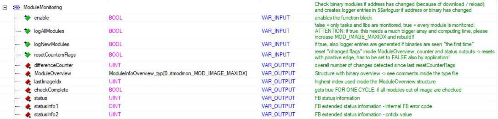
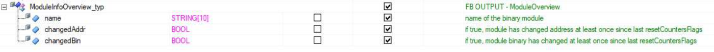
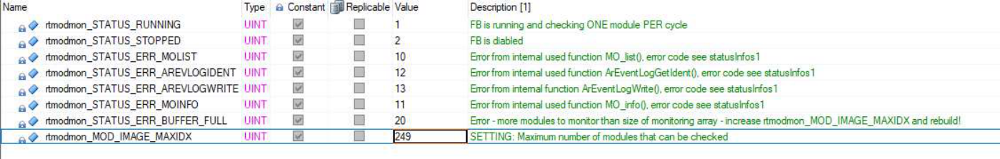
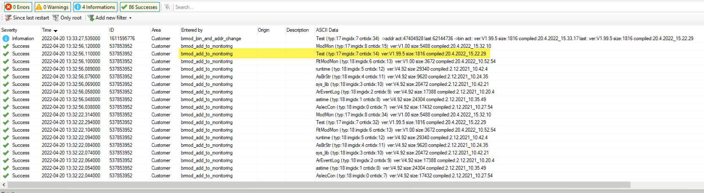
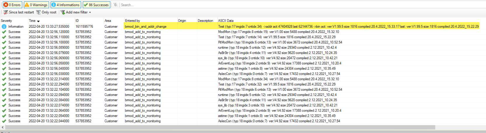
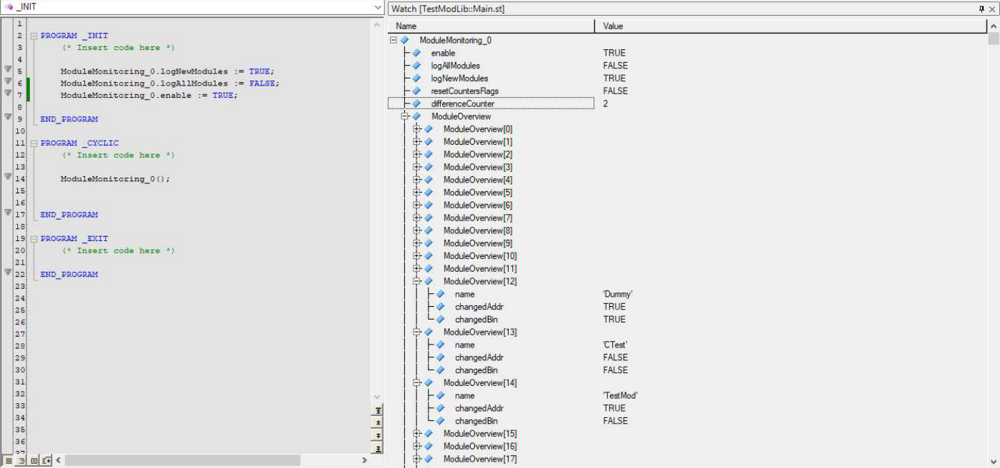

# RtModMon 

The library RtModMon includes a function block "ModuleMonitoring": 

- The FB monitors the addresses of binary modules in memory for changes. 

- If changes are detected, a log entry is generated. 

- Furthermore, the FB also provides information via its outputs about how many and which modules have changed. 

**For computational reasons, not all modules can be monitored simultaneously at runtime; only one module is checked for changes per PLC cycle and FB call!** 

**The information regarding module changes, and therefore also the timestamps in the logbook, is not real-time information!** 

**The use case of the FB is therefore aimed at debugging and change information, as well as non-time-critical reactions to changes in a module within the application.** 

The complete FB interface is described via the comments in the FB declaration; only parts of the interface are briefly discussed here: 

- The function block must be called cyclically with ".enable = TRUE"; ".enable = FALSE" stops the monitoring, but retains the status and information outputs in their last state; a subsequent rising edge deletes this information and restarts the monitoring. 

- ".logAllModules = FALSE" only monitors module types 17 and 18 for changes (tasks and libraries; it cannot distinguish between user library and B&R library!) – this is the recommended setting for monitoring changes to your own application! 

   - “.logAllModules = TRUE” monitors ALL modules – in this case, the internal memory should be significantly increased by adjusting the constant “rtmodmon_MOD_IMAGE_MAXIDX”, as significantly more computing power will then be required for the FB. 

- A positive edge on “.resetCounterFlags” resets all status and information outputs of the FB. 

- The output “status” signals the operating state of the FB, the possible states are declared and documented in the constants of the library. 

FB interface , data types and constants 

# Logger entries 

If “ModuleMonitoring.logNewModules” is set to “true”, a log entry will be generated for each monitored module when the FB is started. 

This serves to provide information about which modules are being monitored for changes (which in turn depends on the setting "ModuleMonitoring.logAllModules"). 

These entries are marked by "brmod_add_to_monitoring", the ASCII data contains the module name as well as other information (the other information is usually only needed for debugging purposes). 

# If a change is detected in a monitored module, a log entry is also generated. 

If only the address of the module in the DRAM changes, the entry is marked with "brmod_addr_change"; if the binary module has also changed in addition to the address, the marking is "brmod_bin_and_addr_change"). 

The case where only the address changes can occur, for example, when only a functional change is made to a library, but the library instance store remains unchanged – in this case, only the library itself is transferred. However, due to the dependency on the library, tasks that use it must be unloaded and reloaded. 

The ASCII data contains the name of the module, as well as the information that has changed. 

# Status information regarding module changes in the application 

When changes are detected in modules, the total number of detected changes since the last reset is output at the ".differenceCounter" output. In the array “.ModuleOverview”, the corresponding flags are set for the modified module(s): “changedAddr” for address changes, “changedBin” for binary changes. 

All status information at the outputs (including the FB status outputs!) is reset by a positive edge at the input “.resetCounterFlags”. 

