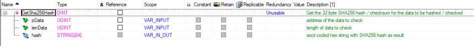
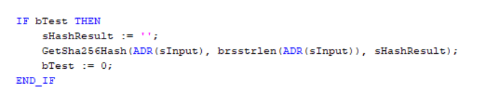
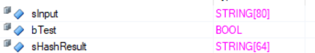
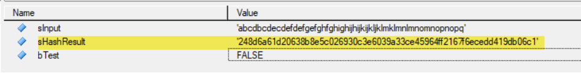
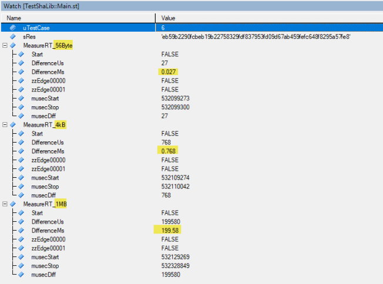
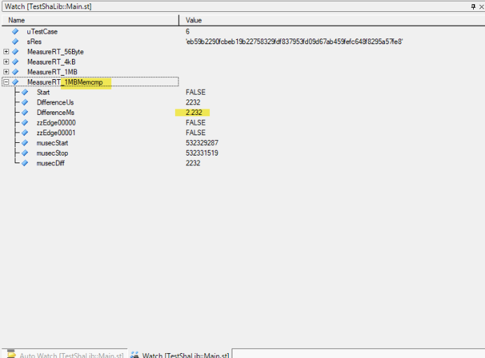

“Sha256lib” generates a SHA256 hash (“checksum”) over a data range (e.g., a string). The hash is output as ASCII-encoded hexadecimal numbers . 

Functional interface: 

Example call: 

# WARNING: 

As with other crypto algorithms, such implementations are of course only conditionally suitable for the cyclic system - larger amounts of data should not be processed using them, due to the way the algorithms work (block formation in loops that cannot be designed "asynchronously" + therefore complete processing in one task cycle). 

Test run with different data sizes on an X20P3585: 

This results in a linear relationship between "data size and processing time", on the X20CP3585 for example approx. 0.19 - 0.2 microseconds per byte (net runtime, without further tasks / task classes). 

In comparison, the runtime of a brsmecmp ( ) call for approximately 1MB of data is approximately 2.232 milliseconds, compared to approximately 199.58 milliseconds for calculating the SHA256 checksum. 

- This implementation of the checksum algorithm should not be used "to check memory contents for changes" when this can also be achieved by "making a copy of the memory and comparing it to the copy" (in which case, of course, twice the amount of memory is necessary!). 

