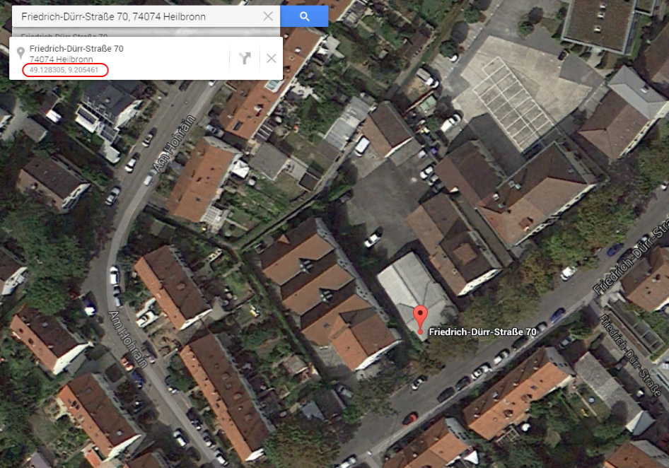
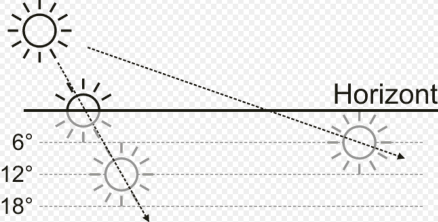
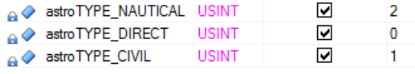
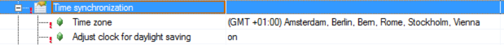
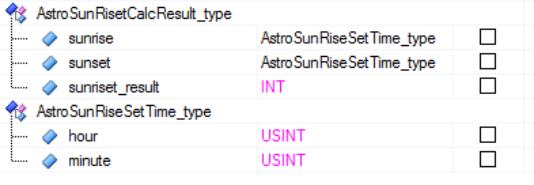
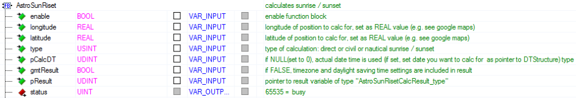
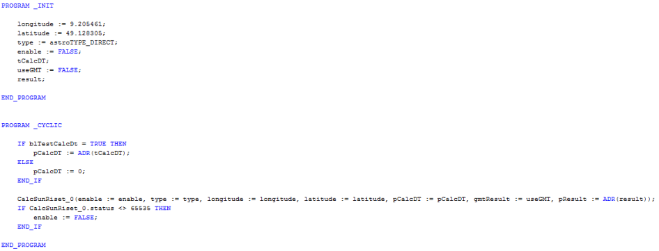
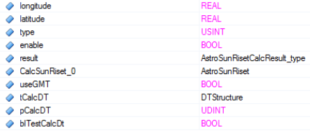

# **Library TBSWAstro** 

# **Function block “ AstroSunRiset ”** 

The function block calculates the times of sunrise and sunset based on a given geolocation. 

The following can be calculated: 

- Sunrise and sunset times for the current date 

   - With or without taking into account the values set on the PLC for time zone and summer/winter time 

- Sunrise and sunset on any given date 

The geolocation is specified using latitude and longitude (as REAL values). The coordinates can be determined, for example, in Google Maps by zooming in on the desired destination and clicking on it . 

## **Fub -Inputs “ longitude ”, “ latitude ”** 





The direct time (sun crosses the horizon) can be calculated, as well as the so-called civil sunrise /sunset (sun 6° below the horizon) and the nautical sunrise/sunset (sun 12° below the horizon). 





## **Fub input “type” with the following constants:** 





The calculation is performed for the current date (read internally by the FUB) if no specific date is set. 

- **Fub input “ pCalcDT ” = 0** 

If a calculation is to be performed for a specific date, a pointer to a structure of type " DTStructure " must be passed to the input " pCalcDT " where the elements " year ", " month " and " day " are set to the desired values. 

## **Fub input “ pCalcDT ” = ADR( myDate )** 

PLC settings regarding time zone and summer/winter time are taken into account in the result if the function block input “ gmtResult ” is not set. 





## **Fub input “ gmtResult ” = FALSE** 

If the result is to be calculated without taking the settings into account, the input must be set to TRUE; in this case, the GMT time will be returned as the result. 

## **Fub input “ gmtResult ” = TRUE** 

The result of the calculation is returned in a variable of type " AstroSunRisetCalcResult_type ". This variable must be declared in the task and connected as a pointer to the function block . 

## **Fub input “ pResult ” = ADR( myResult )** 





The result then contains sunrise and sunset times in hour and minute (e.g., " myResult.sunrise.hour " = hour of sunrise). 

The element " myResult.sunriset_result " contains information about whether the calculation was correct ( myResult.sunriset_result = 0). If this value is not 0, the result is invalid (e.g., because the sun does not set at the specified geolocation at the time of calculation). 

The function block requires several cycles to complete the calculation; therefore, it must be called repeatedly until the FUB output “ status ” is not equal to BUSY (65535). 


## **Fub output “ status ” <> 65535** 





## **Example call** 








## **Functionality used** 

The code is based on a public domain implementation; the functionality described above only provides a "wrapper" for the calculation for Automation Studio. Original code from: 

```
/*
Written as DAYLEN.C,1989-08-16
Modified to SUNRISET.C,1992-12-01
(c)Paul Schlyter , 1989, Released in 1992 to the public domain by Paul Schlyter , December 1992
*/
```


