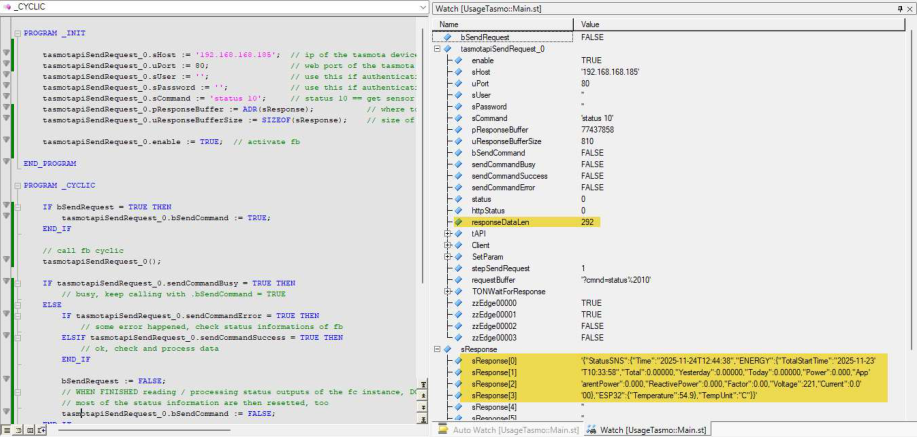

Tasmota is a very well- known open-source implementation for microcontrollers based IoT devices (ESPbased, like ESP32, ESP8266) mostly used in smart home applications: https://tasmota.github.io/docs/ 

Tasmota provides webserver based access (and many more interfaces!), where also a command API can be used via the webserver. 

The library „TasmotAPI“ provides a http client implementation (based on the ashttp library) to communicate with such a Tasmota firmware based device via the web API. 

The implementation just provides the webservice access itself, not the parsing of the JSON based response data -> this must be done by own code! 

Commands and responses depend on the Tasmota device, please see here in the Tasmota command reference: 

https://tasmota.github.io/docs/Commands/ 

How to use: please see the simple sample task provided together with the library. For example, after requesting the command “status 10” from the Tasmota device (“status 10” means: deliver sensor data), the device response is a JSON based object containing all sensor information of the device. 

“Status 10” on my test device (a smart plug with measurement functions) responses for example with the following JSON object: 

