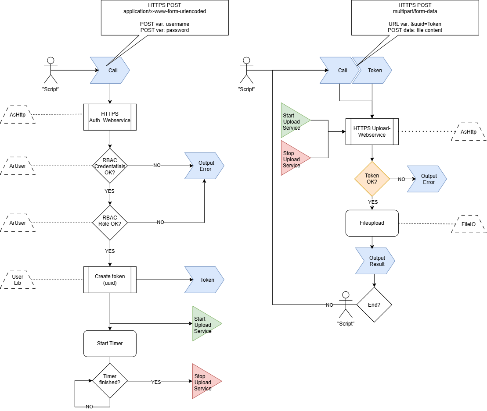
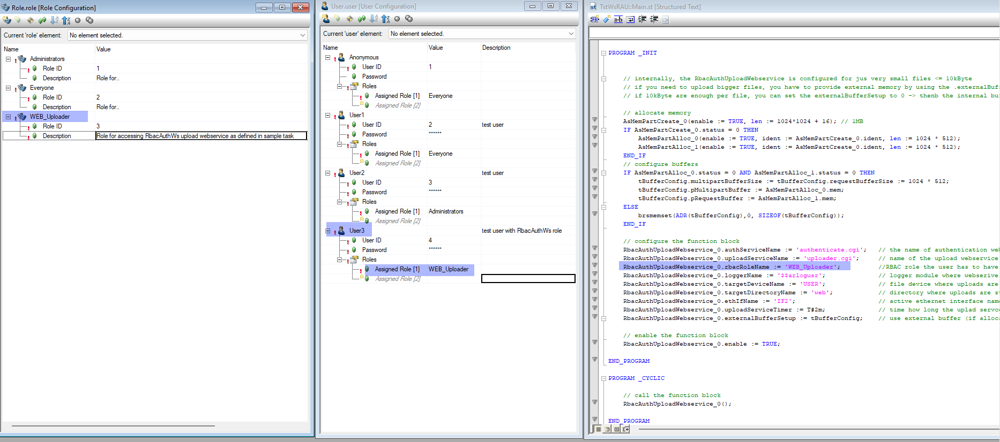
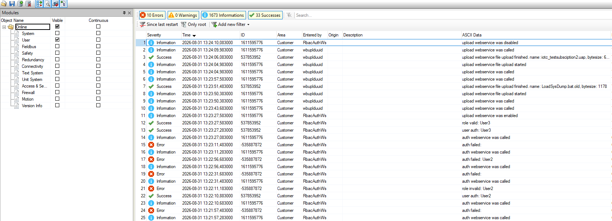
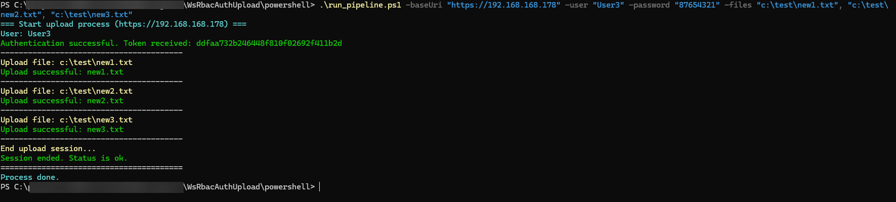
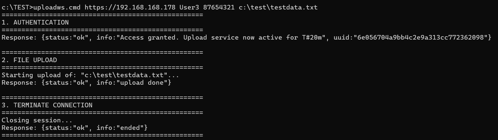
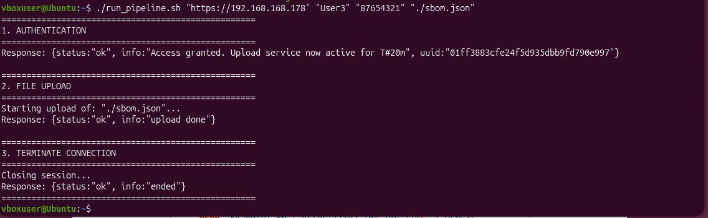
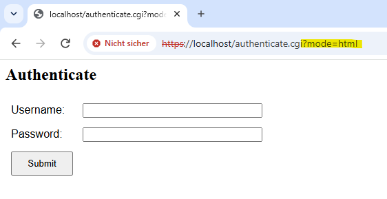
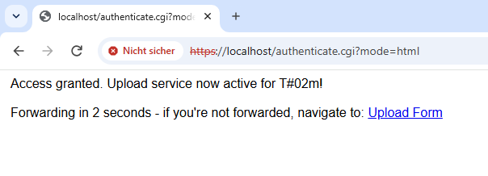
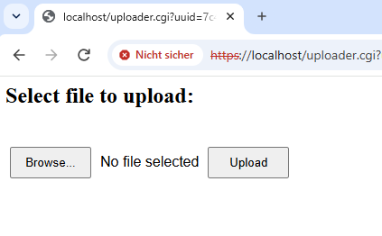
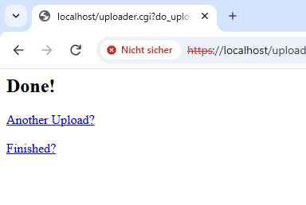

# Libraries RbacAuthWs + wbuplduuid

## About
The package "WsRbacAuthUpload" contains the 2 libaries + some script samples.

These 2 libaries implement a HTTPS-based file upload webservice with authentication using Automation Runtime-integrated RBAC (Role Based Access Control).
The functionality is intended to used via scripts, so no GUI / UI interfaces are implemented (almost: for debugging & tests a plain HTML interface for use in browser exists).
"RbacAuthWS" is the "main" webservice and does the authentication, and calls internally an instance of "wbuplduuid" which is doing the upload of one(!) file.

**This is NOT some high-end security implementation!**

But at least I tried to implement basic security by using a separation of concerns approach, a short-lifetime session token mechanism,
a webservice implementation where the service just has exactly that restricted functionality that I need, and some logging is done inside the PLC logger (and for sure, only https is allowed).
And yes, for the script call the password is plain readable - that means that the system where the script is executed for sure has to be a secure and controlled environment!

## Concept
Here's the concept / architecture picture explaining a bit more the separation of concerns model used.

To be honest, it's not a full separation of concerns, as internally the upload webservice (wbuplduuid) is instanced directly by the authentication webservice. 
But it is very easy to divide it into two complete independent calls / tasks by changing a few lines of code - I merged it just because of the usability.



## How it works

### authenticate
The main webservice needs 3 parameters to authenticate if a upload should be allowed.

Parameters:

* "user" : the user name
* "password" :  the users password
* "_ts" : a unique value that is different from the last call

These parameters have to be send by the client (the "script") **as POST variables** via a https post request to the webserver. 
If the credentials are okay AND the user additionally has the right role (which is setup at the function block interface inside the PLC),
the main webservice generates a unique token, starts the upload webservice (for a limited time, that is also setup at the fuction block),
and reports the token to the client.

### upload
The client then has to call the upload webservice as a https post request with **a URL encoded set of parameters** + the file data as multipart form-data.

Parameters:
* "uuid" : the token
* "do_upload=true" : the signal that a file should be uploaded

If uploading multiple files, repeat this type of request with the different files and the the same token.


### finish
The client calls again the upload webservice as described above at upload section (or in this case just as a GET request as no content is needed), but without a file content and with a different parameter set.

Parameters:
* "uuid" : the token
* "end_upload=true" : the signal that the process is finished

If the finish step is not send by the script, the upload service is automatically stopped after the time configured at the function block parameter.

### testing without a script
For test purposes without using a script, some extremely minimalistic & ugly HTML interface is existing (just 2 input fields + button for authentication, and 2 buttons for choosing and sending a file).

To use this interface, call the service from the brower with a URL encoded parameter: "authenticate.cgi?mode=html".

## How to use on PLC side

### dependencies
Beside the dependencies to some B&R libraries, the 2 webservice libraries described here need also the library "UUIDgen", which is not part of the package "WsRbacAuthUpload",
but is also available inside this repository: [UUIDGenerator](https://github.com/hefnera71/BnRCommunitySamples/tree/master/AS412CodeSamples/Logical/UUIDGenerator)

### function block interface

```
	VAR_INPUT
		enable : BOOL; (*enable the function block*)
		authServiceName : STRING[80]; (*name of the main webservice*)
		uploadServiceName : STRING[80]; (*name of the upload webservice*)
		loggerName : STRING[32]; (*logger module name where messages from the webservices are logged*)
		rbacRoleName : STRING[80]; (*name of the user role that has to match to grant upload*)
		targetDirectoryName : STRING[100]; (*directory name where uploads are stored*)
		targetDeviceName : STRING[100]; (*file device name for the upload service*)
		ethIfName : STRING[80]; (*name of the active ethernet interface (needed for token generator)*)
		uploadServiceTimer : TIME; (*time how long the upload webservice is enabled until auto closing*)
		externalBufferSetup : WebUpload_extbuffer_wbuuid_typ; (*external memory buffer configuration*)
	END_VAR
	VAR_OUTPUT
		wsAuthEnabled : BOOL; (*main webservice is enabled*)
		status : UINT; (*status of the main webservice *)
		wsUploadEnabled : BOOL; (*upload webservice is enabled*)
		statusWsUpload : UINT; (*status of the upload webservice*)
		wsUploadCounter : USINT; (*number of uploads since reboot*)
		wsUploadLastFileName : STRING[100]; (*name of the last file uploaded*)
		wsUploadLastFileSize : UDINT; (*size in byte of the last file uploaded*)
		wsUploadTimerET : TIME; (*elapsed time since upload service was enabled*)
		uuidGenPhase : USINT; (*phase of the token generator -> 2 = ready*)
	END_VAR

	WebUpload_extbuffer_wbuuid_typ : 	STRUCT 
		pRequestBuffer : UDINT;
		pMultipartBuffer : UDINT;
		requestBufferSize : UDINT;
		multipartBufferSize : UDINT;
	END_STRUCT;
```

### call example
The task "TstWsRAU" contains a simple example how to setup and call the function block. Just the function block "RbacAuthUploadWebservice" out of the 
library "RbacAuthWs" has to be configured and called.

```
PROGRAM _INIT

	// configure the function block   		
	RbacAuthUploadWebservice_0.authServiceName := 'authenticate.cgi';	// the name of authentication webservice
	RbacAuthUploadWebservice_0.uploadServiceName := 'uploader.cgi';		// name of the upload webservice
	RbacAuthUploadWebservice_0.rbacRoleName := 'WEB_Uploader';			//RBAC role the user has to have
	RbacAuthUploadWebservice_0.loggerName := '$$arlogusr';				// logger module where webserive actions should logged to
	RbacAuthUploadWebservice_0.targetDeviceName := 'USER';				// file device where uploads are stored
	RbacAuthUploadWebservice_0.targetDirectoryName := 'web';			// directory where uploads are stored
	RbacAuthUploadWebservice_0.ethIfName := 'IF2';						// active ethernet interface name - needed for token generation
	RbacAuthUploadWebservice_0.uploadServiceTimer := T#2m;				// time how long the uplad servce should be active
	RbacAuthUploadWebservice_0.externalBufferSetup := 0;				// don't use external buffer
	
	// enable the function block
	RbacAuthUploadWebservice_0.enable := TRUE;
	
END_PROGRAM

PROGRAM _CYCLIC
	
	// call the function block
	RbacAuthUploadWebservice_0();
	 
END_PROGRAM

```

### File size 
With the internal buffer in the webservice, only very small files are uploadable (file size <= 10kByte). This restricition is based on my use-case, where just files with around 2kB are used.

If you need to upload larger files, you can configure external buffers in the needed size.
To do so, you need to:
* provide 2 buffer of the same size (by declaration of USINT arrays, or by allocating memory from heap using library AsMem which is the preffered way, as it's much more flexible).
```
	AsMemPartCreate_0(enable := TRUE, len := 1024*1024 + 16); // allocating 1MB
	IF AsMemPartCreate_0.status = 0 THEN
		AsMemPartAlloc_0(enable := TRUE, ident := AsMemPartCreate_0.ident, len := 1024 * 512); // reserve 0.5 MB block
		AsMemPartAlloc_1(enable := TRUE, ident := AsMemPartCreate_0.ident, len := 1024 * 512); // reserve 0.5 MB block
	END_IF
```
* declare a variable of typ "WebUpload_extbuffer_wbuuid_typ" (this typ is exported by the library "wbuplduuid")
```
	VAR
		tBufferConfig : WebUpload_extbuffer_wbuuid_typ;
	END_VAR
 ```
* connect the addresses and sizes of the 2 buffers to this variable
```
	tBufferConfig.multipartBufferSize := tBufferConfig.requestBufferSize := 1024 * 512;
	tBufferConfig.pMultipartBuffer := AsMemPartAlloc_0.mem;
	BufferConfig.pRequestBuffer := AsMemPartAlloc_1.mem;
```
* connect the variable to the function block input ".externalBufferSetup"
```
	RbacAuthUploadWebservice_0.externalBufferSetup := tBufferConfig;	// use external buffer (if allocation was ok)
```

The sample task contains an example for external buffers using AsMem.

### RBAC setup and relationship to the libraries

The user + password + role defintion is done inside Automation Studio.
The role is not transferred via webservice but defined at the function block input parameter ".rbacRoleName".
It's crucial to work with a dedicated role, because it makes no sense if every user existing in the RBAC setup automatically inherits the right to upload files.



### logging
The libraries are logging information about access to the webservices in the PLC logger automatically, just the logger module has to be configured at the function block interface.



## How to use on client side
As mentioned, the intended use is by script. Therefore he're some cURL examples

Please note, that all of this examples including the scripts are using the cURL --insecure parameter or similar. The reason is that I'm using self-signed certificates that aren't in the clients trust lists.
This is not an issue of the PLC or the implementation, it's just because of the restrictions of my test systems (as well in my Automation Studio SSL configuration as on my Windows).

1.) Authenticate:

Request:

curl -k -X POST -d "user=<AR USERNAME>" -d "password=<USERS PASSWORD>" -d "_ts=<SOME RANDOM VALUE>" -H "Content-Type: application/x-www-form-urlencoded" https://localhost/authenticate.cgi

Responses:
* {status:"ok", info:"Access granted. Upload service now active for T#02m", uuid:"c18b7e08948b4f638e8dbb5939b6e6b9"} --> response ok
* {status:"error", info:"parameters missing?"} --> parameter _ts=<VALUE> has the same value as with the last call, or some other mandatory parameter is missing
* {status:"error", info:"user auth error"} --> username or password is wrong
* {status:"error", info:"user role error"} --> username and password was right, but user does not have the user role needed

Call example:
```
Request: curl -k -X POST -d "user=User3" -d "password=87654321" -d "_ts=%RANDOM%" -H "Content-Type: application/x-www-form-urlencoded" https://192.168.168.178/authenticate.cgi
```

2.) Upload:

Request:

curl -k -X POST -F filename=@<LOCAL FILE> -H "Content-Type: multipart/form-data" "https://localhost/uploader.cgi?do_upload=true&uuid=< THE TOKEN GOT FROM THE AUTHENTICATION CALL >"

Responses:
* {status:"ok", info:"upload done"} --> response ok
* *html response instead of json* .... 405 Method Not Allowed</h1> Sorry, your request couldn't be fullfilled. .... --> the webservice isn't running
* *html response instead of json* .... 413 Request Entity Too Large</h1> Sorry, your request couldn't be fullfilled .... --> the file is too big for the configured memory buffer
* {status:"error", info:"uploading unauthorized or uuid missing"} --> wrong or missing token

Call example:
```
Request: curl -k -X POST -F filename=@c:\test\testdata.txt -H "Content-Type: multipart/form-data" "https://192.168.168.178/uploader.cgi?do_upload=true&uuid=84e9f2f4e01c43ce94fec4615c4adfba"
```

#### 3.) Finish:

Request:

curl -k -X GET "https://localhost/uploader.cgi?end_upload=true&mode=json&uuid=< THE TOKEN GOT FROM THE AUTHENTICATION CALL >"

Responses:
* {status:"ok", info:"ended"} --> response ok
* *errors see "upload" (service not running anymore, wrong token)*

Call example:
```
Request: curl -k -X GET "https://192.168.168.178/uploader.cgi?end_upload=true&uuid=84e9f2f4e01c43ce94fec4615c4adfba"
```


#### Sample for requests and responses of a complete successful upload session:

```
c:\TEST>curl -k -X POST -d "user=User3" -d "password=87654321" -d "_ts=%RANDOM%" -H "Content-Type: application/x-www-form-urlencoded" https://192.168.168.178/authenticate.cgi
{status:"ok", info:"Access granted. Upload service now active for T#2m", uuid:"84e9f2f4e01c43ce94fec4615c4adfba"}

c:\TEST>curl -k -X POST -F filename=@c:\test\testdata.txt -H "Content-Type: multipart/form-data" "https://192.168.168.178/uploader.cgi?do_upload=true&uuid=84e9f2f4e01c43ce94fec4615c4adfba"
{status:"ok", info:"upload done"}

c:\TEST>curl -k -X GET "https://192.168.168.178/uploader.cgi?end_upload=true&uuid=84e9f2f4e01c43ce94fec4615c4adfba"
{status:"ok", info:"ended"}
```


### sample scripts
The package "client_scripts" contains 3 example scripts for communication with the webservice.

Powershell:


CMD:


bash:


### Using HTML interface for testing

As described above, a simple user interface for manual upload tests is integrated.
To start it, the main webservice is called with an additional parameter "mode=html" in the browser.

For example:
```
https://192.168.168.178/authenticate.cgi?mode=html
```



After successful authentication, a information is displayed. Normally there's no user action needed, a forwarding to the upload service should happen automatically. 



In the upload service user interface, the file to upload has to be selected and the upload has to be started:



After upload is finished, the user can decide to finish the process or upload another file:



## External references
* The initial functionality of "wbuplduuid" was developed under the name "WebUpload" by Andreas W. (many thanks!).
* The sample scripts for cmd, ps and bash are AI generated.

