# About

First: this is a some years old project where I played around with C#.Net and Visual Studio.
It was a quick & dirty overnight solution, so don't blame me for the code quality (which is quite poor in terms of OOP and clean code).
But as it's used by a few people here and there, I share it publicly anyway.

It's a VS2026 community edition project using .NET 4.8.

**If you don't want to build it on your own, the EXE build can be found directly under [./bin/release](https://github.com/hefnera71/BnRCommunitySamples/tree/master/Misc/ASOutputAnalyse/ASOutputAnalyse/bin/Release)**

# AsOutputAnalyse - What is it good for?

The tool "AsOutputAnalyse " is intended for software developers or support engineers using B&R Atuomation Studio, and can be used to get a quick overview about the number of similar errors / warnings of a Automation Studio project build.

**This tool only provides a different way sorting the Automation Studio output data for analysing a AS build output file a bit more comfortable then using a plain text editor!**

## Settings that have to be done in Automation Studio

**To analyze outputs from Automation Studio log window, first writing the output to a file has to be enabled**. The option can be found in "Tools -> Options" menu, tab "General".

It's recommended to use **a much bigger log file size then default**, to get complete build information from bigger projects inside one log file.

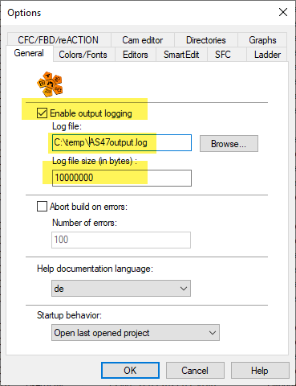

# "AsOutputAnalyse " User interface

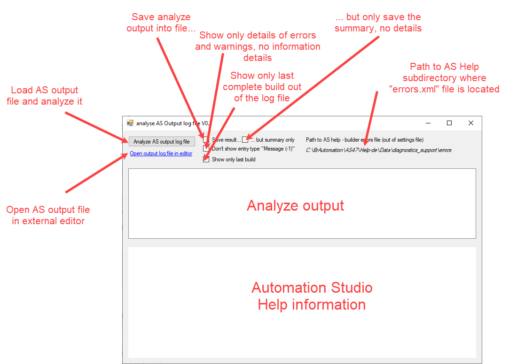

## How to use?

After loading a AS output file, **all** build-runs inside this file are analyzed (incomplete build-runs are skipped).

Each build process is displayed as a single treeview node.

(If "Show only last build" is checked (before start analyzing!), only the newest complete build is shown.)

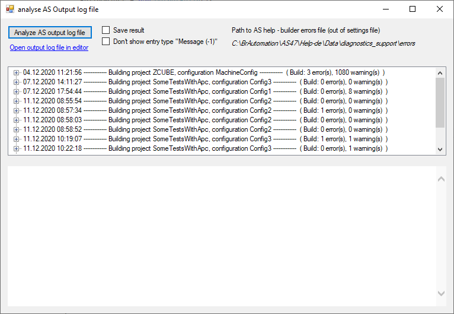

Inside a build-run, the messages / errors / warnings are grouped by the number as followed:

{ count } type : number (build step)

### Example:

{ 79 } Warning : 1283 (IecCompiler)

… means, that in this build-run the compiler for IEC programs (like structured text) has reported in total 79 times the warning 1283

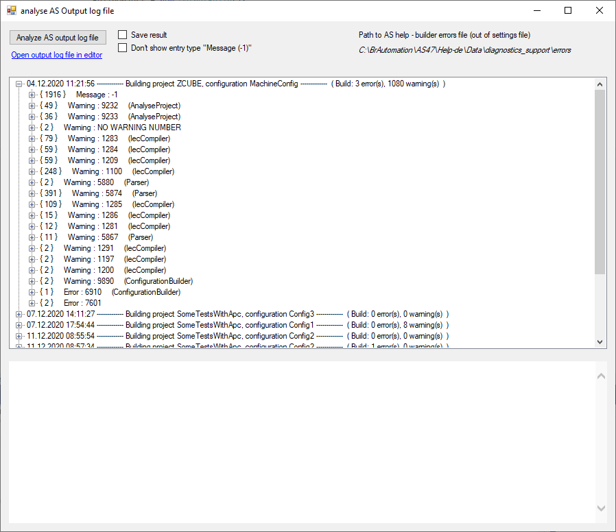

If the parameter for the Automation Studio Help path is set (inside the settings file, see below), for the active treeview node also the help information about this warning / error number is displayed directly.

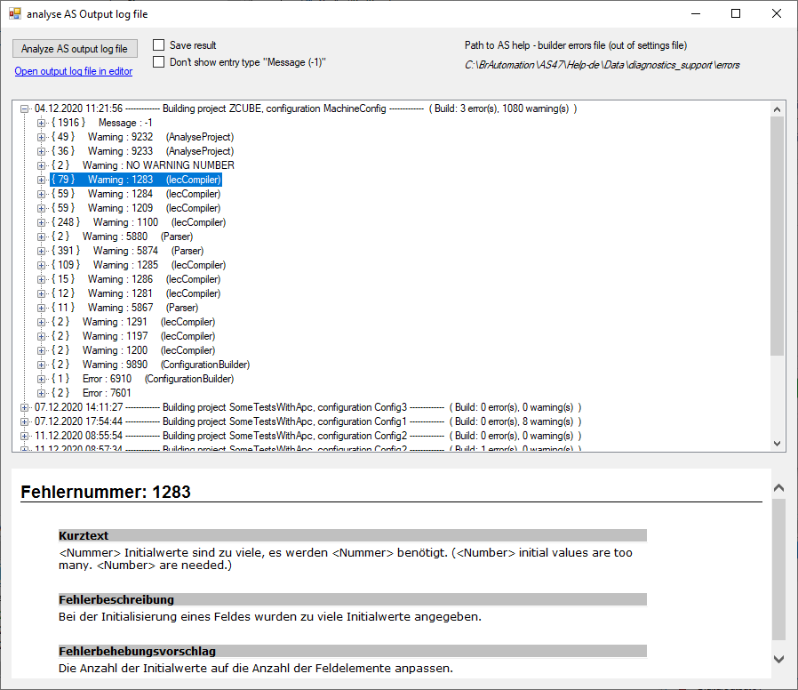

Opening the child node in the tree view, more details are shown

- One node for each entry detected with the same error / warning number
- One or more child nodes (depending on the type of the parent node) with more details
  - Path of the source file
  - Position inside the source file
  - Date and time stamp of the entry
  - Entry number inside this build
  - Line number inside the origin log file

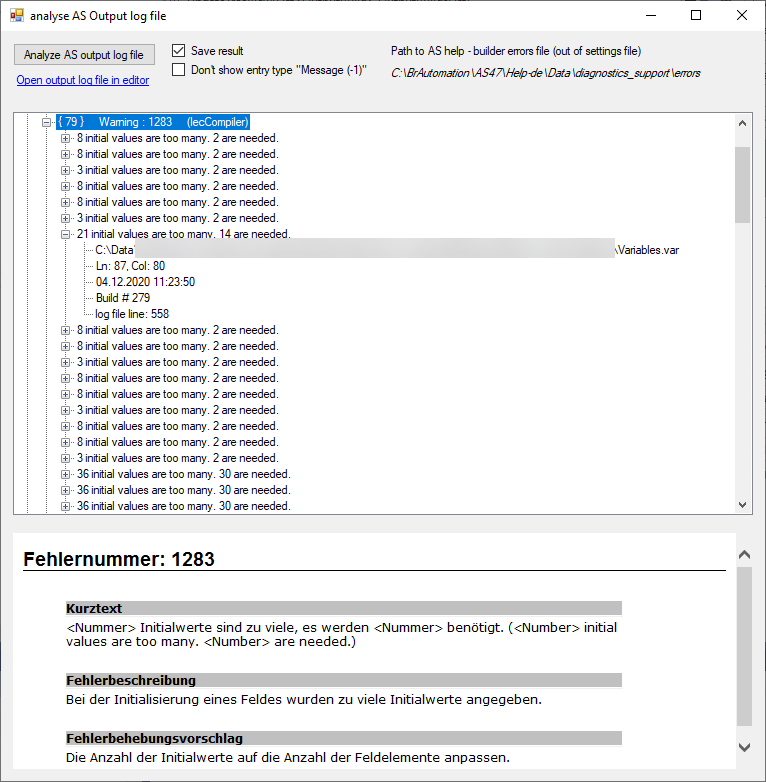

# "AsOutputAnalyse" Settings

Settings can be changed in the file "AsOutputAnalyse.**set**", which is located at the same position as the .exe-file

(If using command line parameters, most of the settings are ignored!)

## Using AS Help output
For the AS Help path, the yellow marked part of the path is installation-, language- and AS version-dependent, the green part should be the same for all AS installations.

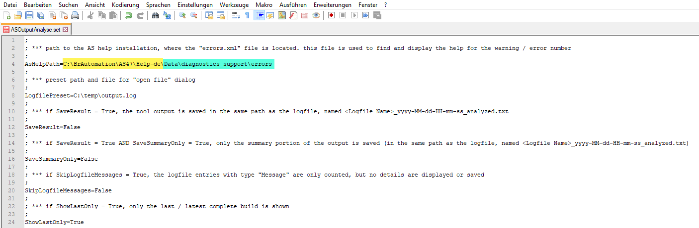

## Saving output results as text file
Output of "save result…", "…but only summary" checkboxes...

... if checked, the analyze result (content in the treeview) is also saved into a text file when analysis is done.

... if "… but summary only" is checked, only the "\* Summary" portion of the output is saved.

The result file is generated at the same position then the origin file with a name:

&lt;Name of the origin file&gt;\_yyyy-MM-dd-HH-mm-ss_analyzed.txt

(if using command line parameters, the file name has to be set by user!)

Example output

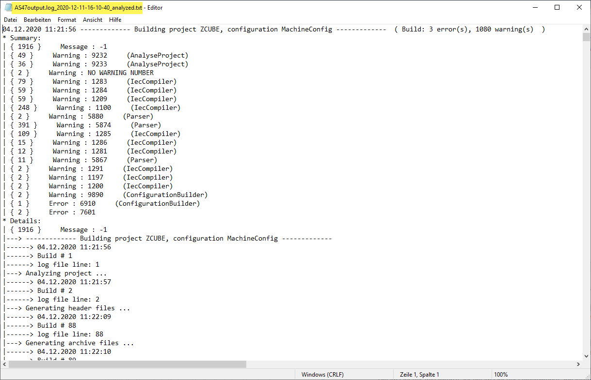

# AsOutputAnalyse .exe - Command Line Interface

Since V0.2 the tool implements a command line interface, e.g. for usage with a CI chain / for post-build events.

**The CLI ignores most of the settings inside the settings file!**

Following CLI parameters are implemented:

| \-in=&lt;AS build log file&gt;                        | The Automation Studio output log file to analyze                                                                                                                                                                                                                                                                      | Mandatory / Optional                                                                      |
| ----------------------------------------------------- | --------------------------------------------------------------------------------------------------------------------------------------------------------------------------------------------------------------------------------------------------------------------------------------------------------------------- | ------------------------------------------------------------------------------ |
| \-out=&lt;ASOutputAnalyse file&gt;                    | The ASOutputAnalyse result file (only used if parameter "-result" or "-summary" is used)                                                                                                                                                                                                                              | Mandatory, if "-result", "-summary"                                            |
| \-result                                              | Save the complete analyze result (see "-out=&lt;..&gt;")                                                                                                                                                                                                                                                              | Optional                                                                       |
| \-summary                                             | Save only the analyze result overview (see "-out=&lt;..&gt;")                                                                                                                                                                                                                                                         | Optional                                                                       |
| \-skipmsg                                             | No details of information entries out of the build log                                                                                                                                                                                                                                                                | Optional                                                                       |
| \-last                                                | Use only the newest complete build ot of build log                                                                                                                                                                                                                                                                    | Optional                                                                       |
| \-autoclose                                           | Don't show GUI after analyze (for generating result file only)                                                                                                                                                                                                                                                        | Optional<br><br>Mandatory for AS Post Build, see -aspostbuild                |
| \-aspostbuild                                         | ONLY FOR USE if tool is used with Automation Studio Post-Build event!! If set, -autoclose is also set automatically because if not AS won't finish build!                                                                                                                                                             | Mandatory for AS Post Build                                                    |
| \-userwarnings=&lt;text file with search patterns&gt; | (new in V0.3) <br>ONLY FOR USE if tool is used with Automation Studio Post-Build, everything else makes not really sense. <br><br/>Has to be the path to a text file with strings to search for - if a "search string" is found, a popup appears with information that a "user pattern" was found … example see below | Optional, if used it SHOULD be used in conjunction with -last and -aspostbuild |

## Sample 1: usage from command line, only generate result file

We want to generate a detailed result file from the newest build, but no message details and no GUI

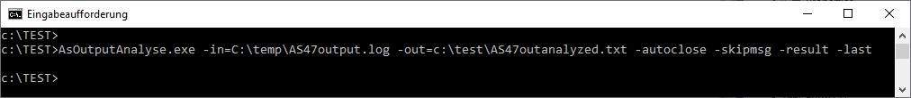

Output:

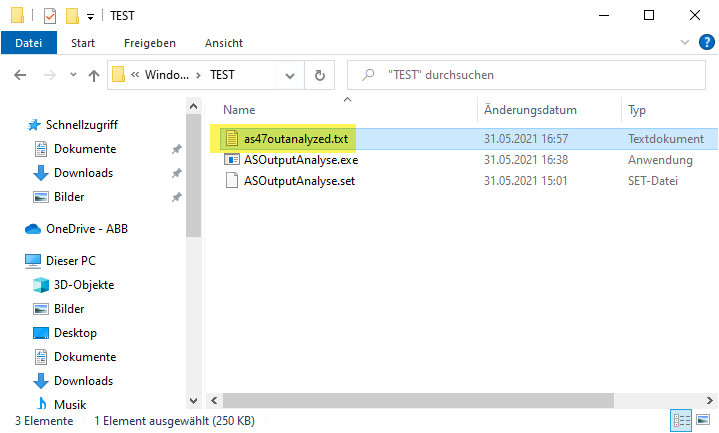

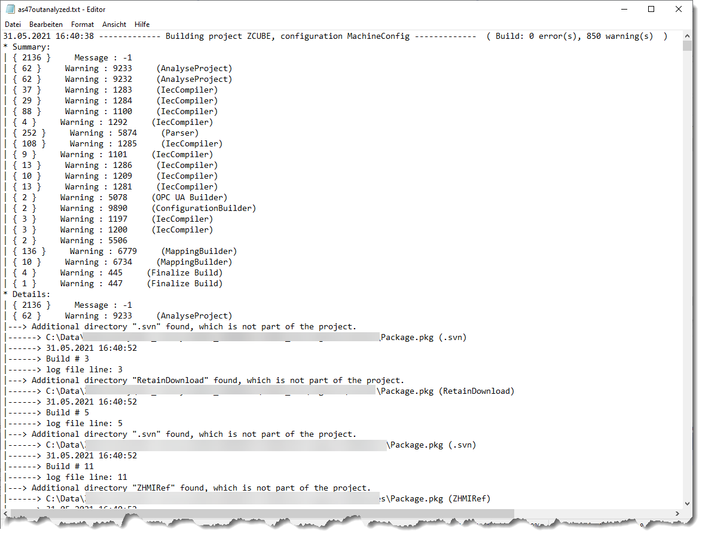

## Sample 2: usage from command line, show results in GUI only

We want to see the detailed result of the last build inside the GUI, no result file needed.

(Please note the tool headline: tool was started from command line, so the settings file is ignored)

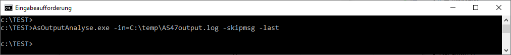

Output:

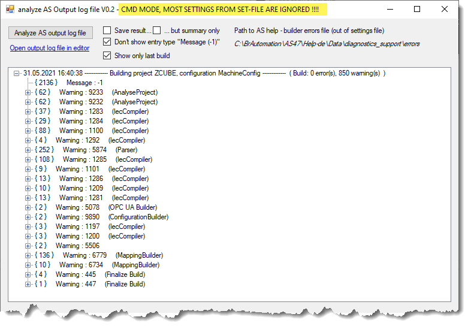

## Sample 3: usage with Automation Studio Post-Build Step

After a successful Automation Studio build, we want to get a summary of different warnings of the last build.

(Please note the mandatory(!) parameter "-aspostbuild" for this use case like described above)

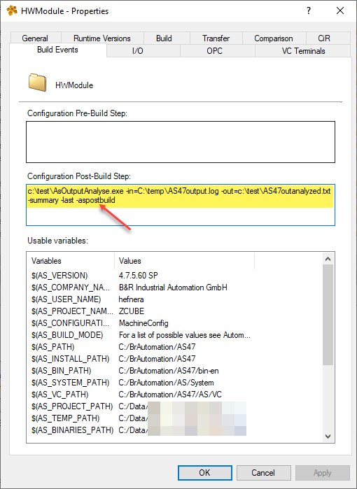

Output:

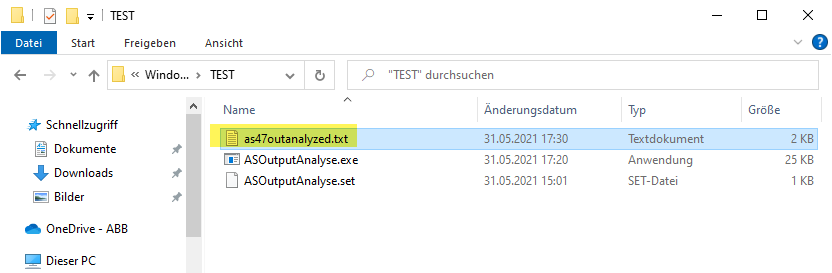

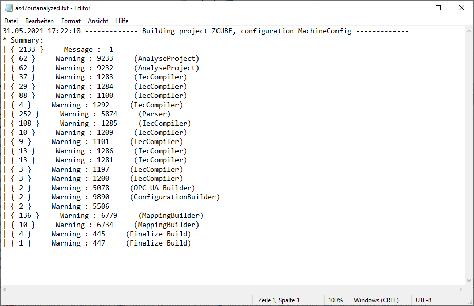

## Sample 4: The user should get "warned" if some specific outputs are inside the log file (since V0.3)

Use case: the user should pay attention on some specific information inside the AS output, e.g. "some warnings that don't lead to compile errors maybe will still lead to non-functional software".

The functionality "makes only sense" if used with Automation Studio Post-Build Step and only analyzing the latest compile run (it works in other combinations too, but there's no advantage then).

With the parameter "-userwarnings" a text file has to be specified which contains one or more "text fragments" - every entry in the AS log file is checked if the fragment is part of the whole message.

If fragments are detected, a popup with appear to inform the user.

**_Please be aware: the AS build process will be finished after closing thins popup, not before!_**

**_So the use case of this feature is for "live usage", not for automatic build&release processes!_**

### Example text file

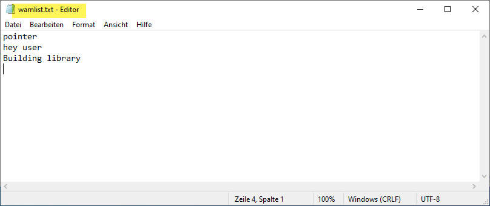

### Automation Studio example post-build step
please see also the AS setup for generating log files at the beginning of this document.

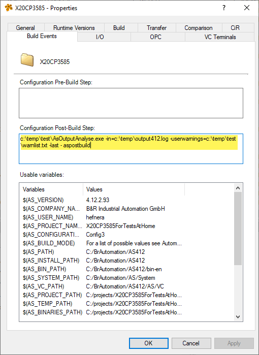

```
c:\\temp\\test\\AsOutputAnalyse.exe -in=c:\\temp\\output412.log -userwarnings=c:\\temp\\test\\warnlist.txt -last -aspostbuild
```

### Popup after post-build (if patterns were found)

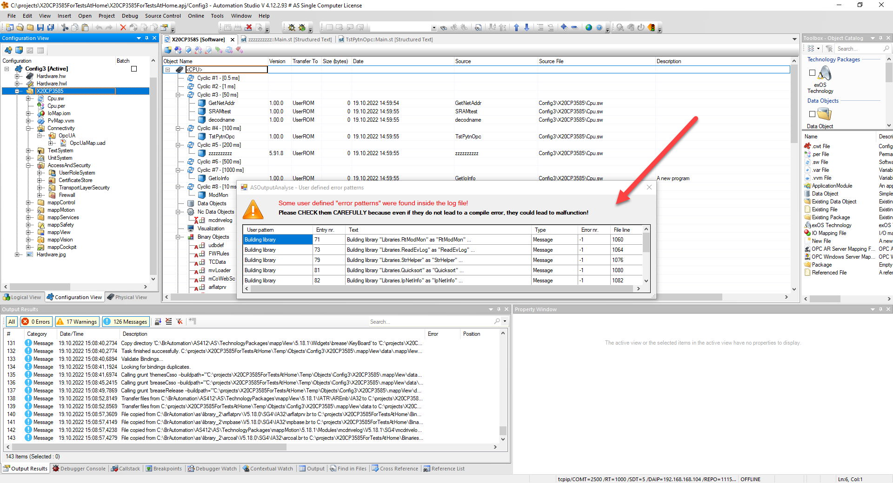

… all entries containing the patterns defined in the "pattern file" (see example above) are listed - pattern match is case independent, every type of output is checked (no matter if it's a error, warning, message, …) !!

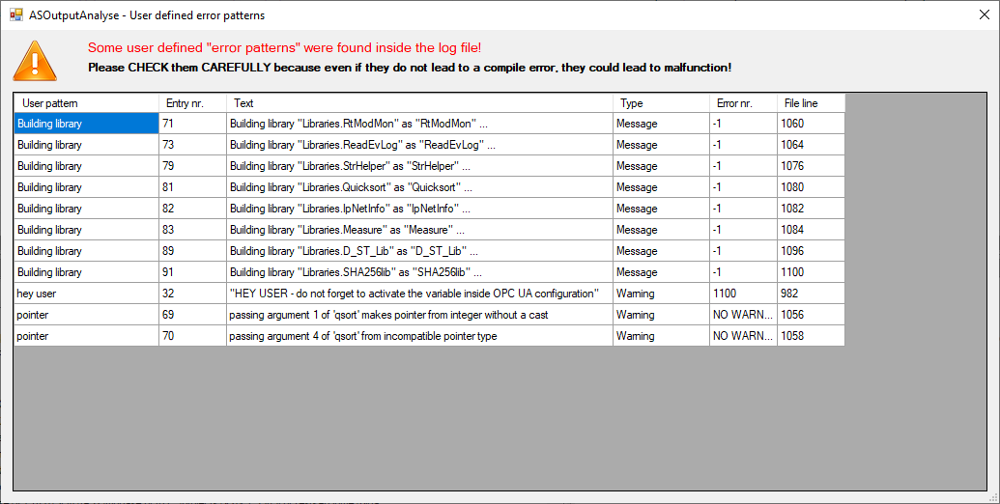
